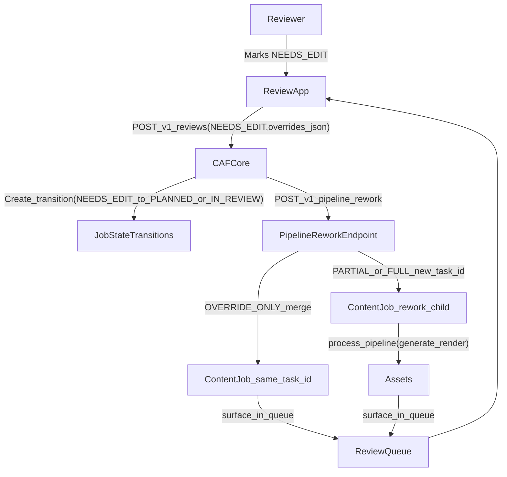
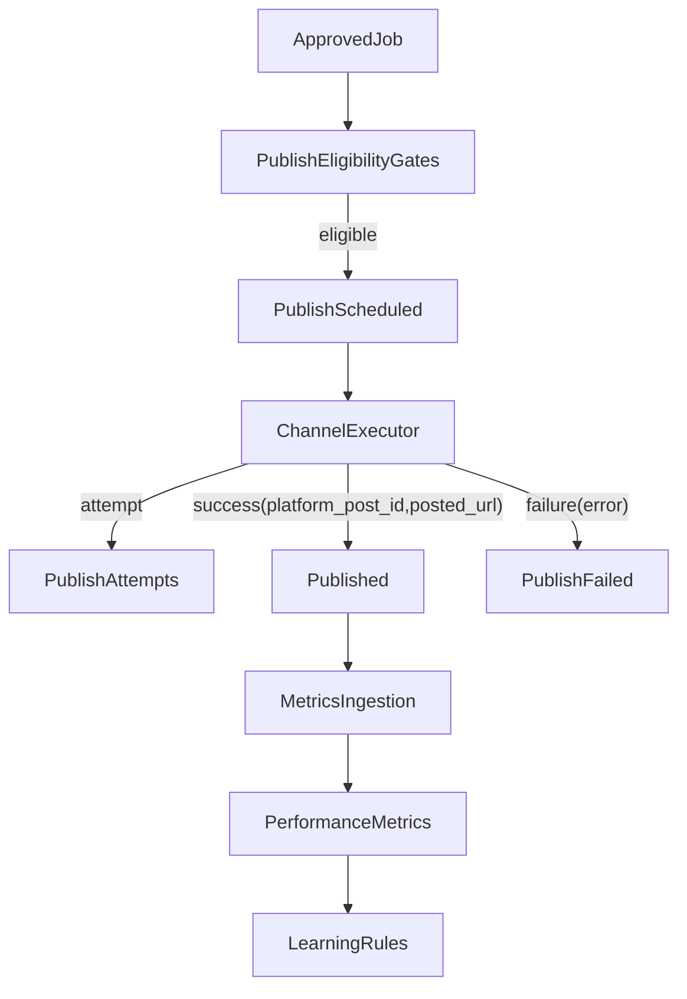

# CAF (Content Automation Framework) — Summary & What’s Missing

## What CAF is

CAF is a content operating system designed to turn market signals into consistently publishable content, then improve that content over time by learning from:

- **diagnostics** (machine evaluation of quality and risk)
- **editorial feedback** (human review decisions + overrides)
- **market outcomes** (post-publication performance)

CAF’s practical “funnel” is:

**Signal Pack → Candidates → Decision Engine → Content Jobs → Drafts → Rendering → Review → Publishing → Learning**

## How CAF is set up today (migration reality)

CAF currently operates as a distributed system:

- **n8n** orchestrates workflows (LLMs, rendering calls, polling, routing).
- **Google Sheets** act as the visible control plane and operational memory (runtime queue, review queue, config).
- **Supabase** holds durable task/asset rows and stores media binaries with stable URLs.
- **Fly.io services** provide HTTP-reachable workers (carousel renderer, video assembly, media gateway).
- **Review App** provides the human approval/edit surface.
- **CAF Core (this repo)** is the emerging center: explicit domain model, database-first state, decision traces, learning primitives, and adapters to ingest state from Sheets/Supabase.

## Core entities (mental model)

- **Project**: a brand/container (strategy, rules, prompt versions, learning rules).
- **Run**: one execution cycle for a project (tied to one signal pack/evidence window).
- **Signal Pack**: run-level intelligence bundle with `overall_candidates_json`.
- **Candidate**: one idea × one flow type (built in-memory; not necessarily persisted as first-class rows).
- **Content Job**: the atomic executable unit keyed by `task_id` (center of the system).
- **Job Draft**: generation attempts / revisions for a job (preserves rework history).
- **Asset**: produced artifacts (PNG, MP4, audio, subtitles) linked to `task_id`.
- **Editorial Review / Validation Events**: human decisions and state transitions.
- **Diagnostic Audit**: structured quality/risk evaluation.
- **Performance Metrics**: post-publication outcomes.
- **Learning Rules / Experiments**: structured changes + measurement.

## What CAF Core is trying to become

CAF Core’s north star is to reduce “truth trapped in flows + sheets” by owning:

- explicit state transitions (queryable history)
- decisioning + suppression with traces (“why did we do this?”)
- learning loops that reliably change future behavior (not analytics theater)
- APIs/contracts that are testable and versioned

## What’s still missing (known gaps)

### 1) Rework flow (NEEDS_EDIT → regenerate → re-review)

When a reviewer marks **NEEDS_EDIT**, the system needs a first-class, repeatable workflow:

- create a **new Job Draft** (preserve attempt/revision history)
- apply reviewer overrides / structured edit instructions
- regenerate (optionally re-render)
- re-route back to **IN_REVIEW**
- keep a clean audit trail linking the edit to the prior decision and the new draft

This is a core “taste feedback” loop. Without it, editorial learning exists but can’t operationalize improvements safely.

#### Rework workflow spec (migration-compatible, DB-first)

**Core entities** (see `03_domain_model.md`):
- `content_jobs` (execution row keyed by `task_id`)
- `editorial_reviews` (human decision + `overrides_json`)
- `job_drafts` (revision memory: `attempt_no`, `revision_round`, `generated_payload`)
- `job_state_transitions` (immutable audit trail)

**Trigger**
- A human submits a review via `POST /v1/reviews` with `decision = NEEDS_EDIT` (see `docs/API_REFERENCE.md`).

**Rework modes (practical)**
- **OVERRIDE_ONLY**: reviewer provided clean override fields; no regeneration needed.
- **PARTIAL_REWRITE**: regenerate but preserve as much context as possible.
- **FULL_REWORK**: regenerate with strong “start over” signal.

CAF Core already supports this mode split in `src/services/rework-orchestrator.ts` and exposes:
- `POST /v1/pipeline/:project_slug/task/:task_id/rework` (see `src/routes/pipeline.ts`)

**Job-level state transitions (compatible with observed statuses)**
- `NEEDS_EDIT → IN_REVIEW` (override-only path; same `task_id`)
- `NEEDS_EDIT → PLANNED → GENERATING → (RENDERING) → IN_REVIEW` (partial/full path; new `task_id`)

**Draft semantics (must not overwrite history)**
- Always preserve prior generated content by keeping the previous `editorial_reviews` row and `content_jobs.generation_payload` intact.
- For partial/full rework, create a new rework child job with:
  - `content_jobs.rework_parent_task_id = <original_task_id>` (see `migrations/004_rework_and_publish_fields.sql`)
  - a new `draft_id` (stored in `generation_payload.draft_id` today)
- Target-state: insert an explicit `job_drafts` row for each rework attempt so revision memory is queryable without parsing JSON.

**Audit trail requirements**
- Insert a `job_state_transitions` row for:
  - “rework requested” (at review submission time, `triggered_by = human`)
  - “rework submitted” (when the reworked job returns to `IN_REVIEW`)
- Linkage must always be possible via `(project_id, task_id)` and `rework_parent_task_id` (no FK reliance; text-ID joins only).

**Integration contract (review app → core → orchestrator)**
- **Review App → CAF Core**:
  - Send `decision = NEEDS_EDIT`, `rejection_tags`, `notes`, and `overrides_json` (structured overrides).
- **CAF Core → orchestration**:
  - For override-only: merge overrides into the existing job’s `generation_payload.generated_output`, transition back to `IN_REVIEW`.
  - For partial/full: create a new rework job (`task_id__rework_<ts>` today), run the standard pipeline, then surface the new `task_id` in the review queue.

### 2) Publishing layer (workflow, not just a ledger)

Publishing exists conceptually and partially as a results recording layer, but it is not yet a mature subsystem with:

- publish-ready eligibility gates (post-approval)
- channel-specific publish executors/adapters
- idempotent publish attempts (retry-safe)
- state transitions + event log (“scheduled → publishing → published/failed”)
- performance ingestion pipeline that reliably links metrics back to `task_id`

Market learning becomes materially stronger once publishing and metrics ingestion are first-class and reliable.

#### Publishing workflow spec (workflow, not just ledger)

**Today’s reality (legacy contract to preserve)**
- Publishing is executed by n8n workflows that post to Meta Graph for **Instagram** and **Facebook**.
- Common fields in those flows include:
  - `publish_target` (`Instagram` | `Facebook`)
  - `publish_caption`
  - `publish_media_urls` / `publish_media_urls_json` (carousel)
  - `publish_video_url` (video)
  - result fields: `post_success`, `platform_post_id`, `posted_url`, `publish_error`

**Eligibility gates (CAF Core-owned, pre-executor)**
- A job is publish-eligible only if:
  - latest `editorial_reviews.decision = APPROVED`
  - required assets exist in `caf_core.assets` and have stable `public_url`
  - required publication metadata is present (caption/hashtags as needed; see `src/services/publish-metadata-enrich.ts`)
- If gates fail, publishing should not execute; emit a durable reason so operators can fix and retry.

**Publishing workflow states (separate from job lifecycle)**
- Create a dedicated publishing attempt lifecycle:
  - `SCHEDULED → PUBLISHING → PUBLISHED | FAILED`
- Keep this state machine independent of `content_jobs.status` so rework/review doesn’t get conflated with publish retries.

**Idempotent publish attempts (retry-safe)**
- Each attempt must be uniquely keyed by:
  - `(project_id, task_id, platform, idempotency_key)`
- Store:
  - request payload snapshot (what we tried to publish)
  - provider response snapshot (what the platform returned)
  - `platform_post_id` and `posted_url` when successful
  - terminal failure reason when failed

**Channel-specific executors/adapters**
- Implement executors behind a narrow interface, e.g.:
  - input: `task_id`, `platform`, asset URLs, caption, adapter config
  - output: `platform_post_id`, `posted_url`, raw provider response
- During migration, the first executor can remain “call n8n workflow” while later evolving into direct platform adapters.

**Performance ingestion pipeline (links back to `task_id`)**
- CAF Core already exposes `POST /v1/metrics` and persists `caf_core.performance_metrics` keyed by `(project_id, task_id)` (see `docs/API_REFERENCE.md`, `src/services/market-learning.ts`).
- Required hardening:
  - ensure metrics ingestion can always map **provider post id → task_id**
  - store both early and stabilized windows (`metric_window` = `early` | `stabilized`)
  - make ingestion idempotent by a batch id / unique key (so re-runs don’t duplicate)

#### Phased implementation order (so this becomes shippable)

- **Phase 1 (Rework MVP)**: make `NEEDS_EDIT` reliably produce either an override-only re-review or a new rework child job, with `rework_parent_task_id` + transitions recorded.
- **Phase 2 (Publishing MVP)**: add publish eligibility gates + publish attempts + executor contract (initially via n8n callout) + publish state log.
- **Phase 3 (Market loop hardening)**: provider post-id mapping + idempotent metric ingestion + stabilized-window analytics that reliably feed LearningRules.

#### Acceptance criteria (doc-level, but tied to real endpoints/tables)

- **Rework is operationally triggerable**: given a job with a latest review `NEEDS_EDIT`, CAF Core can execute rework via `POST /v1/pipeline/:project_slug/task/:task_id/rework` and the outcome is visible in:
  - `caf_core.editorial_reviews` (request)
  - `caf_core.content_jobs` (updated same `task_id` for override-only; new `task_id` child for partial/full)
  - `caf_core.job_state_transitions` (audit trail)
- **Publishing is spec’d as a workflow**: docs define eligibility gates, attempt lifecycle, executor interface, and the required mapping to metrics ingestion keyed by `task_id`.
- **All join keys remain stable**: all described cross-table linkage is by `(project_id, task_id)` and/or `(project_id, run_id)`; `task_id` remains the primary execution key (see `08_current_ids_and_state_conventions.md`).
- **Docs link to the canonical references**:
  - domain model: `03_domain_model.md`
  - learning loops: `07_learning_layer_spec.md`
  - IDs/states: `08_current_ids_and_state_conventions.md`
  - API routes: `docs/API_REFERENCE.md`

## Why these gaps matter

- Without **rework**, CAF can generate content but can’t iterate based on human corrections in a durable, repeatable way.
- Without **publishing**, CAF can’t close the loop with outcomes, making market learning and experiments weaker than they should be.

