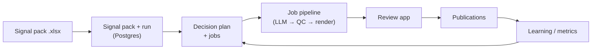

# CAF Core

CAF (Content Automation Framework) is a **content operating system**: **signals → candidates → decisions → jobs → drafts → rendering → review → publishing → learning**. This repository is **CAF Core** — a **self-contained** Fastify + Postgres platform: operational truth, domain logic, and APIs live here. Companion services (Review app, renderer, video assembly) talk to Core over HTTP; nothing external is required for planning, jobs, review, publishing, or learning beyond what you configure in `.env` (database, models, media URLs, storage).

**How you run it:** ingest research as **Excel (`.xlsx`)** (upload or CLI), store it as a **signal pack** and **run** in Postgres, plan **content jobs** with the **decision engine**, run the **job pipeline** (LLM, QC, diagnostics, carousel/video/scene rendering), approve in the **Review** app, record **publication placements**, and feed **performance** back into learning.

---

## What Core owns

- **Domain model + text IDs** — `run_id`, `candidate_id`, `task_id`, `asset_id`, scene IDs; stable joins on `(project_id, task_id)` / `(project_id, run_id)` (see `.cursor/rules/caf-domain-model.mdc` in-repo).
- **Database-first state** — jobs, drafts, transitions, editorial reviews, diagnostic audits, auto-validation, metrics, learning rules, publication placements, API audit trails.
- **Decisioning** — scoring, caps, suppression, prompt/route selection, persisted **`decision_traces`** (`POST /v1/decisions/plan`).
- **Execution** — orchestration in `src/services/job-pipeline.ts` (generation, QC, render tickets, HeyGen/Sora/scene paths as configured).
- **Learning loops** — diagnostic, editorial, and market-style inputs exposed under `src/routes/learning.ts` (plus cron-driven editorial analysis where enabled).
- **Operator surfaces** — **`/admin`** HTML on Core, **`apps/review`** Next.js workbench, and **`requests/caf-core.http`** for manual API calls.

---

## Repository layout

| Area | Path | Role |
|------|------|------|
| **CAF Core API** | repo root (`src/server.ts`) | Fastify app: `v1`, runs, signal packs, pipeline, learning, publications, project config, flow-engine metadata, admin, template HTTP for renderers |
| **Review workbench** | `apps/review/` | Next.js 14 UI + route handlers; reads/writes **CAF Core** via `CAF_CORE_URL` / `CAF_CORE_TOKEN`; optional `RENDERER_BASE_URL` for previews |
| **Carousel renderer** | `services/renderer/` | Express + Puppeteer + Handlebars → slide PNGs |
| **Video assembly** | `services/video-assembly/` | Express + ffmpeg → stitch/mux, uploads (often Supabase Storage) |
| **Media gateway** | `services/media-gateway/` | Spawns renderer + video-assembly behind one port |
| **DB migrations** | `migrations/*.sql` | Versioned schema under `caf_core`; tracked in `caf_core.schema_migrations` |

Supporting docs in-repo: **`docs/API_REFERENCE.md`**, **`docs/USER_INPUT_AND_SECRETS.md`**, **`ENV_AND_SECRETS_INVENTORY.md`**, **`video-assembly.md`**, **`caf-services-media-renderer-video.md`**.

---

## End-to-end flow



1. **Ingest** — `POST /v1/signal-packs/upload` (multipart `.xlsx` + `project_slug`) or `npm run start-run:xlsx -- path.xlsx --project SNS` (`src/cli/start-run-from-xlsx.ts`). Parsing: `src/services/signal-pack-parser.ts`.
2. **Plan** — `POST /v1/runs/:project_slug/:run_id/start` (or `…/start-and-process`) runs the orchestrator; jobs land in `caf_core.content_jobs` as **`task_id`**-keyed rows.
3. **Process** — `POST /v1/runs/.../process`, `POST /v1/jobs/.../process`, or pipeline endpoints (below). Rendering calls out to **`RENDERER_BASE_URL`** / **`VIDEO_ASSEMBLY_BASE_URL`**; assets often use **Supabase Storage** when `SUPABASE_*` is set.
4. **Review** — editors use **`apps/review`**; Core persists decisions via **`/v1/reviews`** and review-queue APIs in `src/routes/v1.ts`.
5. **Publish** — placements under **`/v1/publications/:project_slug/...`** (`src/routes/publications.ts`); your publish step (manual, script, or webhook) marks scheduled/published/failed. **`GET .../:id/n8n-payload`** returns a fixed JSON shape for tools that expect that contract (name is historical; Core does not depend on any specific executor).
6. **Learn** — metrics ingestion and learning routes (`src/routes/learning.ts`) close the loop into rules and evidence tables.

---

## CAF Core API modules (where to look)

| Prefix / area | File | Notes |
|---------------|------|--------|
| `/v1/decisions`, `/v1/jobs`, review queue, reviews, metrics, … | `src/routes/v1.ts` | Stable “integration” surface; many bodies documented in `docs/API_REFERENCE.md` |
| `/v1/runs/...` | `src/routes/runs.ts` | List/create runs, start, replan, process run or single job |
| `/v1/signal-packs/...` | `src/routes/signal-packs.ts` | Upload / ingest / list signal packs |
| `/v1/pipeline/...` | `src/routes/pipeline.ts` | Per-job generate, QC, diagnose, full, batch, reprocess, rework |
| `/v1/projects/...` (profile, strategy, brand, …) | `src/routes/project-config.ts` | Tenant configuration |
| `/v1/flow-engine/...` | `src/routes/flow-engine.ts` | Flow definitions, prompts, schemas, QC checks, templates metadata |
| `/v1/learning/...` | `src/routes/learning.ts` | Rules, evidence, performance CSV-style ingest, transparency helpers |
| `/v1/publications/:project_slug/...` | `src/routes/publications.ts` | List/get/create/patch/complete placements; `.../n8n-payload` for a stable publish payload shape |
| `/v1/admin/...`, `GET /admin` | `src/routes/admin.ts` | Operator UI + JSON admin API |
| `/api/templates`, `/api/templates/:name` | `src/routes/renderer-templates.ts` | Public template fetch for Fly renderer (no auth token) |
| `GET /health`, `GET /health/rendering` | `src/server.ts` | Liveness / dependency hints |

---

## Quick start (local)

### CAF Core API (default port **3847**)

```bash
cp .env.example .env    # minimum: DATABASE_URL; see comments for OpenAI, Supabase, renderer URLs
docker compose up -d    # local Postgres, if you use the bundled compose file
npm install
npm run migrate
npm run seed:demo       # optional
npm run dev             # http://localhost:3847/health
```

### Review app (port **3000**)

```bash
cd apps/review
npm install
# Required for Core-backed mode: CAF_CORE_URL=http://localhost:3847
# If Core uses CAF_CORE_REQUIRE_AUTH=1: CAF_CORE_TOKEN=<same secret as CAF_CORE_API_TOKEN>
# Optional: RENDERER_BASE_URL=http://localhost:3333 for carousel preview proxies
npm run dev
```

### Media stack (renderer **3333**, video-assembly **3334**, gateway **3300**)

```bash
cd services/renderer && npm install && cd ../..
cd services/video-assembly && npm install && cd ../..
cd services/media-gateway && npm install && node server.js
```

### Useful CLIs (root `package.json`)

| Script | Purpose |
|--------|---------|
| `npm run start-run:xlsx` | Ingest `.xlsx`, create signal pack + run, optionally process |
| `npm run process-run` | Process jobs for a run (see CLI help / source) |
| `npm run replan-run` | Replan jobs from an existing run |
| `npm run migrate` | Apply SQL migrations |
| `npm test` | Vitest unit tests (`src/**/*.test.ts`) |

---

## Deploy (Fly.io)

Each deployable unit has its own **`fly.toml`** + **`Dockerfile`** where applicable:

| App | Config |
|-----|--------|
| CAF Core | `fly.toml`, `Dockerfile` |
| Review | `apps/review/fly.toml`, `apps/review/Dockerfile` |
| Media gateway | `services/media-gateway/fly.toml`, `services/media-gateway/Dockerfile` |

**Auth:** set `CAF_CORE_REQUIRE_AUTH=1` and `CAF_CORE_API_TOKEN` on Core; clients send `x-caf-core-token` or `Authorization: Bearer …` on protected routes (see `src/server.ts` for public exceptions such as `GET /health` and public template paths).

**Migrations:** safe to re-run `npm run migrate`; applied versions live in `caf_core.schema_migrations`.

---

## Codebase orientation (for contributors)

- **`src/decision_engine/`** — planning: scoring, ranking, suppression, prompt selection, route selection; used by run orchestration and `POST /v1/decisions/plan`.
- **`src/services/job-pipeline.ts`** — large but central: LLM generation, QC, diagnostics, carousel pack, video/scene/HeyGen paths, status transitions.
- **`src/repositories/`** — Postgres access patterns per aggregate (core, runs, assets, learning, publications, etc.).
- **`src/config.ts`** — environment schema (Zod); single place for tunables and feature flags.
- **`services/renderer/templates/`** — Handlebars slide templates consumed by the renderer service (and listed via flow-engine / template APIs as configured).

---

## Documentation map

| Doc | Use |
|-----|-----|
| `docs/API_REFERENCE.md` | HTTP examples for major `/v1/...` bodies |
| `docs/USER_INPUT_AND_SECRETS.md` | Safety / secrets guidance |
| `ENV_AND_SECRETS_INVENTORY.md` | Environment variable inventory |
| `src/adapters/README.md` | CLIs that import from Google Sheets or Supabase-shaped tables into Core (only if you use those sources) |
| `requests/caf-core.http` | REST client snippets |

Add links here to any internal architecture docs you keep outside the repo.
