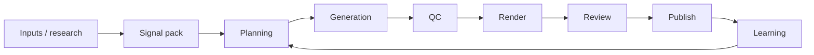

# CAF — Complete product guide

**Purpose:** The definitive **product-level** guide to what CAF is, what it does, who uses it, and how every major capability fits together. For engineering detail, see **[CAF_CORE_COMPLETE_GUIDE.md](./CAF_CORE_COMPLETE_GUIDE.md)**. For a short pitch, see **[CAF_PRODUCT_PITCH.md](./CAF_PRODUCT_PITCH.md)**.

**Convention:** “CAF” means the platform; **CAF Core** is the backend in this repository.

> **Current-state note (2026-07-16):** For the latest operational map (content routes, text/UGC lanes, setup packs, LinkedIn research), prefer **[CAF_CURRENT_STATE_CONTEXT_PACK.md](./CAF_CURRENT_STATE_CONTEXT_PACK.md)**. For ranked improvement planning with Fable: **[FABLE_IMPROVEMENT_BRIEFING.md](./FABLE_IMPROVEMENT_BRIEFING.md)**.

---

## Table of contents

1. [Executive summary](#1-executive-summary)
2. [Platform components](#2-platform-components)
3. [The content funnel](#3-the-content-funnel)
4. [Core concepts](#4-core-concepts)
5. [Upstream: inputs & research](#5-upstream-inputs--research)
6. [Planning & decision engine](#6-planning--decision-engine)
7. [Generation & drafts](#7-generation--drafts)
8. [Quality checks & risk](#8-quality-checks--risk)
9. [Rendering & media](#9-rendering--media)
10. [Human review & rework](#10-human-review--rework)
11. [Publishing](#11-publishing)
12. [Learning & improvement](#12-learning--improvement)
13. [Top-performer mimic & creative intelligence](#13-top-performer-mimic--creative-intelligence)
14. [Flow types (what content CAF can produce)](#14-flow-types-what-content-caf-can-produce)
15. [Multi-tenant projects](#15-multi-tenant-projects)
16. [Operator surfaces](#16-operator-surfaces)
17. [Typical workflows](#17-typical-workflows)
18. [Integrations & external systems](#18-integrations--external-systems)
19. [What CAF is not](#19-what-caf-is-not)
20. [Documentation map](#20-documentation-map)

---

## 1. Executive summary

**CAF** (Content Automation Framework) is a **content operations platform** for teams that produce scaled social content — carousels, reels, scripted video, and related formats.

It implements a full operating loop:

**Inputs / evidence → Signal pack → Planned jobs → Decision engine → Content jobs → LLM drafts → QC / risk → Rendering → Human review → Rework → Publishing → Performance → Learning**

Unlike a script that calls an LLM once, CAF:

- Stores **every stage** in PostgreSQL (`caf_core` schema).
- Keys work off stable IDs (`task_id`, `run_id`) for traceability.
- Enforces **quality and risk gates** before expensive media steps.
- Keeps **humans in the loop** with structured editorial decisions and rework.
- Feeds **performance and editorial evidence** back into future planning and prompts.

---

## 2. Platform components

| Component | Location | Role |
|-----------|----------|------|
| **CAF Core API** | Repo root (`src/`) | Orchestration, business logic, Postgres, HTTP APIs |
| **Review app** | `apps/review/` | Next.js operator + marketer UI — embedded in Core Fly at `/admin/workbench`; **client** of Core, not DB of record |
| **Carousel renderer** | `services/renderer/` | Puppeteer + Handlebars → slide PNGs |
| **Video assembly** | `services/video-assembly/` | ffmpeg → stitch, mux, subtitles |
| **Media gateway** | `services/media-gateway/` | Single port exposing renderer + assembly |
| **Admin UI** | Core `/admin` | Inputs, processing, project config, flow engine |

**Source of truth:** Postgres `caf_core`, especially **`content_jobs`** and **`generation_payload`**.

---

## 3. The content funnel

| Stage | Product meaning |
|-------|-----------------|
| **Inputs** | Evidence, scrapers, spreadsheets → structured rows |
| **Signal pack** | Curated research bundle for one production cycle |
| **Planning** | Which ideas become jobs, which flows, which prompts |
| **Generation** | LLM produces structured copy / scripts per flow schema |
| **QC** | Automated checks + risk keywords before render |
| **Render** | Carousel PNGs, HeyGen video, scene clips, mimic images |
| **Review** | Human approve / reject / needs edit |
| **Publish** | Placement records + optional platform execution |
| **Learning** | Rules and evidence improve the next cycle |

---

## 4. Core concepts

| Concept | Plain language |
|---------|----------------|
| **Project** | A brand/tenant (e.g. SNS). Strategy, flows, bans, learning rules. |
| **Signal pack** | Research bundle attached to a run — ideas, summaries, visual guidelines. |
| **Run** | One production cycle for a project (e.g. `SNS_2026W09`). |
| **Candidate** | One idea × one flow type — scored in memory during planning. |
| **Content job** | Atomic unit of work. Key: **`task_id`**. Holds **`generation_payload`**. |
| **Draft** | One LLM attempt for a job (revision history). |
| **Asset** | Rendered file (image, video, audio) linked to a job. |
| **Editorial review** | Human decision: approved, rejected, or needs edit. |
| **Publication placement** | Intent to post on a platform + outcome status. |
| **Learning rule** | Structured insight that changes planning or prompts. |

**ID patterns** (examples): `task_id` = `SNS_2026W09__Instagram__FLOW_CAROUSEL__row0002__v1`. Full detail: **[DOMAIN_MODEL.md](./DOMAIN_MODEL.md)**.

---

## 5. Upstream: inputs & research

Before a signal pack exists, CAF can ingest **evidence**:

| Input | How | Product outcome |
|-------|-----|-----------------|
| **Excel / XLSX** | Upload API or CLI | Legacy signal pack rows |
| **Evidence imports** | Admin `/admin/inputs` | Normalized rows in Postgres |
| **Scrapers (Apify)** | Admin scrapers tab | Social posts → same evidence shape |
| **Insights passes** | Admin `/admin/processing` | Broad LLM, top-performer vision (image, carousel, video) |
| **Build signal pack** | Processing API | Curated `jobs_json` / ideas for planning |
| **Creative Intelligence** | Ingest APIs | Archived top-performer media + vision analysis |

**Review app role:** Pipeline pages can **inspect** evidence and signal-pack ideas — processing controls stay in Core admin.

Detail: **[CAF_INPUTS_PIPELINE_ROADMAP.md](./CAF_INPUTS_PIPELINE_ROADMAP.md)**, **[CREATIVE_INTELLIGENCE.md](./CREATIVE_INTELLIGENCE.md)**.

---

## 6. Planning & decision engine

When a **run starts**, CAF:

1. Loads materialized planner rows from the signal pack (`planned_jobs_json`).
2. Builds **candidates** (idea × enabled flow types).
3. **Scores** them (confidence, platform fit, novelty, past performance).
4. Applies **caps** (max carousel/video jobs per run, daily limits).
5. Applies **suppression** and **learning boosts** (rank/score adjustments).
6. Selects **prompts** and **routes** per flow.
7. Creates **`content_jobs`** rows — one per selected plan row.
8. Persists a **decision trace** and **run context snapshot** (what was used to plan).

**Product value:** Transparent, repeatable planning — not “generate everything and hope.”

Detail: **[layers/decision-engine.md](./layers/decision-engine.md)**.

---

## 7. Generation & drafts

For each job in `PLANNED` / `GENERATING` status:

- Resolves **prompt templates** from the flow engine (per project + flow type).
- Builds a **creation pack** (signal context, brand, strategy — mimic jobs filter to a single idea).
- Injects **learning guidance** into prompts where rules apply.
- Calls **OpenAI** (or placeholder mode for testing).
- Validates output against **output schemas** (configurable strictness).
- Stores result in **`job_drafts`** and merges **`generated_output`** into **`generation_payload`**.

**Special paths:** scene bundles, product video, mimic pre-copy (reference resolution before LLM).

Detail: **[layers/generation.md](./layers/generation.md)**, **[GENERATION_GUIDANCE.md](./GENERATION_GUIDANCE.md)**.

---

## 8. Quality checks & risk

**QC runs after generation, before render** (by default).

| Check source | What it does |
|--------------|--------------|
| **QC checklists** | Required keys, lengths, regex, slide counts — per flow |
| **Risk policies** | Keyword scan on generated JSON (scoped per flow type) |
| **Brand banned words** | Project-level word bans merged into same scan |

**Outcomes:** pass, block, rework route, or route to human review. Clean passes still typically require **human review** (`CAF_REQUIRE_HUMAN_REVIEW_AFTER_QC`).

**Important honesty:** Project **risk rules** in admin are **not** the same as QC-enforced **risk policies** — see **[RISK_RULES.md](./RISK_RULES.md)**.

Detail: **[QUALITY_CHECKS.md](./QUALITY_CHECKS.md)**.

---

## 9. Rendering & media

After QC, jobs move to **rendering** based on flow type:

| Format | Production path |
|--------|-----------------|
| **Carousel** | HTTP to carousel renderer → PNG slides → Supabase assets |
| **HeyGen video** | Video agent / avatar API → poll → MP4 asset |
| **Scene assembly** | Sora or other clip provider → video-assembly stitch/mux |
| **Mimic image/carousel** | Image provider (BFL, etc.) + template/DocAI text overlays |

Core tracks **render state** (e.g. HeyGen `video_id`) to avoid double-submission on retries.

Detail: **[layers/rendering.md](./layers/rendering.md)**, **[VIDEO_FLOWS.md](./VIDEO_FLOWS.md)**, **[MIMIC_FLOWS_COMPLETE_GUIDE.md](./MIMIC_FLOWS_COMPLETE_GUIDE.md)**.

---

## 10. Human review & rework

Operators use the **Review app** (or `/v1` APIs):

| Decision | Meaning |
|----------|---------|
| **APPROVED** | Ready for publish (may trigger post-approval LLM review) |
| **REJECTED** | Discarded; lineage preserved |
| **NEEDS_EDIT** | Rework — script, slides, HeyGen prompt, carousel slides, etc. |

**Rework orchestrator** regenerates only what changed, preserving `task_id` and history.

Review supports carousel slide editing, mimic layer positions, visual guidelines, HeyGen prompt tweaks, and debug bundles for support.

Detail: **[layers/review-rework.md](./layers/review-rework.md)**.

---

## 11. Publishing

**Publication placements** record:

- Which job (`task_id`) posts where
- Schedule and status (`draft` → `scheduled` → `published` / `failed`)
- Platform outcome (post ID, errors)

**Executors:**

| Mode | Behavior |
|------|----------|
| `none` | External worker (manual, n8n) completes via API |
| `dry_run` | Immediate fake completion (CI / infra tests) |
| `meta` | Core calls Meta Graph (Facebook Page + Instagram) |

Stable publish payload shape: `GET .../n8n-payload` (name is historical).

Detail: **[layers/publishing.md](./layers/publishing.md)**.

---

## 12. Learning & improvement

CAF closes the loop in **two ways**:

### A. Prompt guidance (generation)
Active learning rules with generation/guidance actions are compiled into text appended to LLM prompts — “don’t quote verbatim” institutional hints.

### B. Planning boosts (selection)
Rules with rank/score actions affect **which jobs get planned** — not the prompt text.

**Additional learning inputs:**
- Performance metrics ingestion (CSV-style)
- Editorial analysis cron (optional)
- Post-approval LLM reviews → **upstream recommendations** → learning observations
- Run context snapshots — fingerprint of prompts + guidance used at plan time

Detail: **[layers/learning.md](./layers/learning.md)**, **[GENERATION_GUIDANCE.md](./GENERATION_GUIDANCE.md)**.

---

## 13. Mimic, BVS, and creative intelligence

**Optional advanced capabilities** for brands with archived winners or a defined Brand Visual System:

### Creative Intelligence (upstream)
1. **Ingest** top-performing posts.
2. **Analyze** visuals (vision models) → styling cues on signal packs.
3. Ground ideas to insights for mimic lanes.

### Mimic carousel lanes (July 2026)

| Lane | Flow | Behavior |
|------|------|----------|
| Manual mimic | `FLOW_TOP_PERFORMER_MIMIC_CAROUSEL` | TP reference frames; `execution_mode: classic` |
| **New visual** | `FLOW_VISUAL_FIRST_CAROUSEL` | Idea + BVS; **no** TP frames; `execution_mode: new_visual` |
| **Why Mimic** | `FLOW_WHY_MIMIC_CAROUSEL` | SIL-driven; `execution_mode: why_mimic` |
| Mimic image | `FLOW_TOP_PERFORMER_MIMIC_IMAGE` | Single-frame `image_full` |

### Brand Visual System (BVS)
- Versioned **`brand_bibles`** per project (`brand_bible_v1`).
- Snapshotted to **`generation_payload.bvs_v1`** when `use_brand_visual_system` is set (visual-first defaults on).
- Drives invented plates (`bvs_render_plan`) and logo/frame overlays at render.

### Render pipeline (all TP-grounded carousel lanes)
1. **Resolve reference** (classic/why mimic) or **new-visual prep** (no references).
2. **Generate** fresh copy (OpenAI).
3. **Render** art-only plates via image providers.
4. **Overlay** text via DocAI/HBS — **never** bake copy into Flux for carousels.
5. **Review** layer editor → cheap reprint or expensive slide regen.

Requires `MIMIC_IMAGE_ENABLED` and provider keys for pixel render.

Detail: **[CAF_CURRENT_STATE_CONTEXT_PACK.md](./CAF_CURRENT_STATE_CONTEXT_PACK.md)** §11, **[MIMIC_FLOWS_COMPLETE_GUIDE.md](./MIMIC_FLOWS_COMPLETE_GUIDE.md)**, **[CREATIVE_INTELLIGENCE.md](./CREATIVE_INTELLIGENCE.md)**.

---

## 14. Flow types (what content CAF can produce)

Flows are registered in the **flow engine** per project. Families include:

| Family | Examples | Maturity |
|--------|----------|----------|
| **Carousel** | `FLOW_CAROUSEL` | Production |
| **Video / reel** | Various `FLOW_*` video kinds | Production (provider-dependent) |
| **Product video** | `FLOW_PRODUCT_*` | Production |
| **Scene assembly** | Multi-clip + stitch | Production when configured |
| **Mimic** | `FLOW_TOP_PERFORMER_MIMIC_*`, `FLOW_VISUAL_FIRST_CAROUSEL`, `FLOW_WHY_MIMIC_CAROUSEL` | Production when `MIMIC_IMAGE_ENABLED=1` |
| **BVS** | `brand_bibles` → `bvs_v1` on jobs | Production (migration 078) |
| **Image product** | `FLOW_IMG_*` | Registered; not fully wired |
| **Offline / legacy** | Some variation names | Excluded from auto-pipeline |

Allowed flows are configured per **project** in `allowed_flow_types`.

---

## 15. Multi-tenant projects

Each **project** (brand) has isolated:

- Strategy defaults and brand constraints (voice, banned words)
- Platform constraints (carousel typography, etc.)
- Allowed flow types and HeyGen config
- Learning rules (project-scoped)
- Risk rules (admin) and risk policies (QC-enforced)
- Brand assets, carousel templates, Meta integrations
- Mimic render settings (optional)

URLs use **`project_slug`** (e.g. `/v1/runs/SNS/...`).

---

## 16. Operator surfaces

| Surface | User | Capabilities |
|---------|------|--------------|
| **Review app** | Editors, marketers, ops | Marketer funnel (`/workspace`, `/brand/[slug]/*`); operator workbench (`/review`, `/t/[task_id]`); carousel + mimic layer editor, live preview, brand styling panel, cheap reprint, expensive regen, publish, learning UI, run logs |
| **Core `/admin`** | Admins, engineers | Inputs, processing, project config, flow engine, diagnostics |
| **HTTP `/v1` APIs** | Integrations | Full pipeline automation |
| **CLIs** | Engineers | Migrate, seed, process-run, xlsx ingest, scrapers |

---

## 17. Typical workflows

### Weekly content cycle (classic XLSX)
1. Upload signal pack XLSX → create run.
2. Materialize jobs → start run → process → render.
3. Review queue → approve winners.
4. Create publication placements → publish.
5. Ingest performance → update learning rules.

### Evidence-driven cycle (inputs pipeline)
1. Upload evidence XLSX or run scraper.
2. Run insights (broad + top-performer tiers).
3. Build signal pack from selected rows.
4. Same plan → generate → QC → render → review → publish → learn.

### Single-job rework
1. Reviewer marks **NEEDS_EDIT** with notes/overrides.
2. Rework orchestrator re-runs generation and/or render.
3. Job returns to review queue with preserved lineage.

---

## 18. Integrations & external systems

| System | Role |
|--------|------|
| **OpenAI** | Generation, QC helpers, insights, mimic copy, optional Sora clips |
| **HeyGen** | Avatar / video agent renders |
| **BFL / DashScope / NVIDIA** | Mimic image edit providers |
| **Supabase Storage** | Asset URLs (slides, video, scenes) |
| **Meta Graph** | Optional in-Core publishing |
| **Apify** | Scraper orchestration for inputs |
| **Google Document AI** | OCR for mimic carousel text placement |
| **n8n / webhooks** | External publish workers via placements API |
| **Fly.io / Vercel** | Deploy Core, media gateway, Review app |

Env reference: **`ENV_AND_SECRETS_INVENTORY.md`**, **`.env.example`**.

---

## 19. What CAF is not

- **Not** a generic chatbot or content calendar alone.
- **Not** a replacement for your creative strategy — it **operationalizes** it.
- **Not** fully no-code — flow engine and prompts are configurable but engineering extends behavior.
- **Not** guaranteeing every registered flow type is production-ready — see flow maturity in §14.
- **Not** storing secrets in git — keys live in env / vault.

---

## 20. Documentation map

| Audience | Document |
|----------|----------|
| **Pitch / evaluators** | [CAF_PRODUCT_PITCH.md](./CAF_PRODUCT_PITCH.md) |
| **This guide** | [CAF_COMPLETE_PRODUCT_GUIDE.md](./CAF_COMPLETE_PRODUCT_GUIDE.md) |
| **Current repo truth** | [CAF_CURRENT_STATE_CONTEXT_PACK.md](./CAF_CURRENT_STATE_CONTEXT_PACK.md) |
| **Stakeholder summary** | [PROJECT_OVERVIEW.md](./PROJECT_OVERVIEW.md) |
| **Engineering merged ref** | [CAF_CORE_COMPLETE_GUIDE.md](./CAF_CORE_COMPLETE_GUIDE.md) |
| **Architecture** | [ARCHITECTURE.md](./ARCHITECTURE.md) |
| **ChatGPT / external repos** | [EXTERNAL_CONTEXT_PACK.md](./EXTERNAL_CONTEXT_PACK.md) |
| **Rebuild stack** | [REBUILD_FROM_DOCS.md](./REBUILD_FROM_DOCS.md) |
| **IDs & tables** | [DOMAIN_MODEL.md](./DOMAIN_MODEL.md), [DATABASE_SCHEMA.md](./DATABASE_SCHEMA.md) |
| **API examples** | [API_REFERENCE.md](./API_REFERENCE.md) |
| **AI coding assistants** | [AGENTS.md](../AGENTS.md) |

---

*CAF — from research to reviewed, publishable content, with gates, humans, and learning at every step.*
