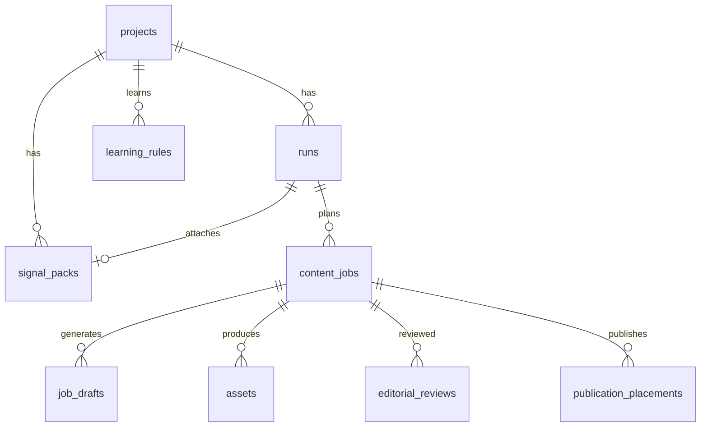

# CAF Core — Database schema reference

**Purpose:** Table catalog for engineers, external re-implementers, and LLMs that need to understand **where state lives** without reading every migration.

**Schema name:** `caf_core`  
**Migrations:** `migrations/*.sql` (applied via `npm run migrate` or `CAF_RUN_MIGRATIONS_ON_START`) — through **`078_brand_bibles.sql`** and later as added  
**Tracking table:** `caf_core.schema_migrations`

> **Updated current-state note (2026-07):** Prefer `docs/CAF_CURRENT_STATE_CONTEXT_PACK.md` §5 when this catalog lags new migrations.

**Join convention:** Prefer **`(project_id, task_id)`** or **`(project_id, run_id)`** text keys — not UUID foreign keys across aggregates.

---

## Core pipeline tables

| Table | Role |
|-------|------|
| `projects` | Tenants; `slug` used in URLs |
| `project_system_constraints` | System-wide caps per project |
| `runs` | Run header; `run_id`, `status`, `signal_pack_id`, `planned_jobs_json` / `candidates_json`, `context_snapshot_json`, `plan_summary_json` |
| `signal_packs` | Research bundles; `jobs_json`, `ideas_json`, `overall_candidates_json`, platform summaries, `visual_guidelines_pack_v1` |
| `content_jobs` | **Central table** — `task_id`, `status`, `generation_payload`, `render_state`, QC columns |
| `job_drafts` | LLM attempts per `task_id` |
| `assets` | Rendered media linked to jobs |
| `job_state_transitions` | Audit log of status changes |
| `decision_traces` | Planning decision snapshots |
| `candidates` | **Historical** — not current planning source of truth |

---

## Review, QC, and validation

| Table | Role |
|-------|------|
| `editorial_reviews` | Human decisions (`APPROVED`, `NEEDS_EDIT`, `REJECTED`) |
| `diagnostic_audits` | Machine diagnostics on jobs |
| `auto_validation_results` | Automated validation records |
| `validation_events` | Validation event stream |
| `llm_approval_reviews` | Post-approval LLM review scores + `upstream_recommendations` |
| `run_output_reviews` | Run-level output reviews |

---

## Flow engine & QC metadata

| Table | Role |
|-------|------|
| `flow_definitions` | Flow types, routing, QC checklist names |
| `prompt_templates` | Prompt bodies and versions |
| `output_schemas` | JSON schema for LLM output validation |
| `carousel_templates` | Carousel HBS template metadata |
| `qc_checklists` | QC check rows (required_keys, regex, …) |
| `risk_policies` | Keyword risk policies (scoped by `applies_to_flow_type`) |
| `prompt_labs_overrides` | Prompt lab experiment overrides |

---

## Project configuration

| Table | Role |
|-------|------|
| `strategy_defaults` | Strategy JSON per project |
| `brand_constraints` | Brand voice, banned words |
| `platform_constraints` | Per-platform limits |
| `risk_rules` | Project risk rows (**not** enforced by QC today — see `RISK_RULES.md`) |
| `allowed_flow_types` | Enabled flows per project |
| `heygen_config` | HeyGen avatar / voice settings |
| `project_product_profile` | Product video profile |
| `project_brand_assets` | Brand images (logo, slide frame, style refs) for HeyGen / mimic / BVS |
| `brand_profiles` | Marketer voice/strategy profile (`migrations/072_brand_profiles.sql`) |
| `brand_bibles` | Versioned **Brand Visual System** — `brand_bible_v1` JSON; snapshotted to `generation_payload.bvs_v1` (`078_brand_bibles.sql`) |
| `project_carousel_templates` | Project-specific carousel templates |
| `project_integrations` | Meta FB/IG IDs, tokens metadata |
| `reference_posts`, `viral_formats` | Reference content config |

---

## Learning & performance

| Table | Role |
|-------|------|
| `learning_rules` | Active/pending rules (`rule_family`, `action_type`, scopes) |
| `suppression_rules` | Planning suppression |
| `learning_observations` | Evidence observations (incl. upstream rec items) |
| `learning_hypotheses`, `learning_hypothesis_trials` | Experiment tracking |
| `learning_insights` | Compiled insights |
| `learning_generation_attribution` | Which rules affected a generation |
| `performance_metrics` | Post-publish metrics |
| `performance_ingestion_batches` | Batch ingest metadata |
| `run_content_outcomes` | Run-level outcome summaries |
| `job_outcomes` | Per-job publish → performance anchor (`migrations/075_job_outcomes.sql`) |

---

## Publishing

| Table | Role |
|-------|------|
| `publication_placements` | Publish intent + status (`draft` → `published` / `failed`) |

---

## Inputs & evidence pipeline

| Table | Role |
|-------|------|
| `inputs_evidence_imports` | XLSX / ingest batch header |
| `inputs_evidence_rows` | Normalized evidence rows |
| `inputs_evidence_row_insights` | LLM/vision insights per row (tiers: broad, top_performer_*) |
| `inputs_evidence_packs` | Packaged evidence for processing |
| `inputs_processing_profiles` | Scoring criteria, models, caps |
| `inputs_source_rows` | Workbook source registry |
| `inputs_scraper_config`, `inputs_scraper_runs` | Apify scraper config + runs |
| `inputs_idea_lists`, `inputs_ideas` | Idea list intake |
| `ideas`, `idea_grounding_insights` | Structured ideas + grounding |
| `signal_pack_ideas`, `signal_pack_selected_ideas` | Ideas linked to signal packs |
| `insights_packs` | Insights pack metadata |
| `qc_flow_profiles` | Per-flow QC profile config |
| `evidence_media_assets` | Archived media for evidence rows |

---

## Creative Intelligence (top-performer mimic upstream)

| Table | Role |
|-------|------|
| `creative_source_assets` | Ingested top-performer media |
| `creative_visual_analyses` | Vision analysis per asset |
| `creative_insights` | Aggregated creative insights |
| `creative_carousel_mimic_templates` | Carousel mimic template library |

---

## Operations & audit

| Table | Role |
|-------|------|
| `api_call_audit` | External API call log + cost estimates |
| `prompt_versions` | Prompt version history |
| `experiments` | A/B prompt experiments |
| `generation_counters` | Generation counters per scope |

---

## Key columns on `content_jobs`

| Column | Purpose |
|--------|---------|
| `task_id` | Primary execution key (with `project_id`) |
| `run_id` | Parent run (text) |
| `candidate_id` | Planner candidate id (text) |
| `flow_type`, `platform` | Routing / QC scope |
| `status` | Job lifecycle state |
| `qc_status`, `recommended_route` | QC outcome (also inside payload) |
| `generation_payload` | **Main JSON contract** — prompts, LLM output, QC, `mimic_v1`, `bvs_v1`, publish URLs |
| `render_state` | Provider session state (HeyGen video_id, etc.) |
| `scene_bundle_state` | Scene assembly progress |
| `review_snapshot` | Snapshot for review UI |

---

## Key columns on `runs`

| Column | Purpose |
|--------|---------|
| `run_id` | Human-readable run key (with `project_id`) |
| `signal_pack_id` | Attached research bundle |
| `status` | Run lifecycle |
| `planned_jobs_json` | Materialized planner rows (canonical) |
| `candidates_json` | Legacy alias (dual-written) |
| `context_snapshot_json` | Prompt versions + learning fingerprints at plan time |

---

## ER sketch (logical, not SQL FKs)

---

## Bootstrap order for a fresh database

1. `npm run migrate` — applies all `migrations/*.sql` in order
2. `npm run seed:demo` or `npm run seed:canonical-flows` — optional demo project + flows
3. `npm run seed:flow-engine` — flow definitions and prompts (as needed)
4. Configure project via admin or `import:project-csv`

---

## See also

- [DOMAIN_MODEL.md](./DOMAIN_MODEL.md) — IDs and lifecycles
- [REBUILD_FROM_DOCS.md](./REBUILD_FROM_DOCS.md) — full bootstrap guide
- [ARCHITECTURE.md](./ARCHITECTURE.md) — which repositories read/write these tables
- `migrations/001_caf_core_schema.sql` — original core DDL

*Table list aligned with migrations through 069. When in doubt, grep `CREATE TABLE` in `migrations/`.*
