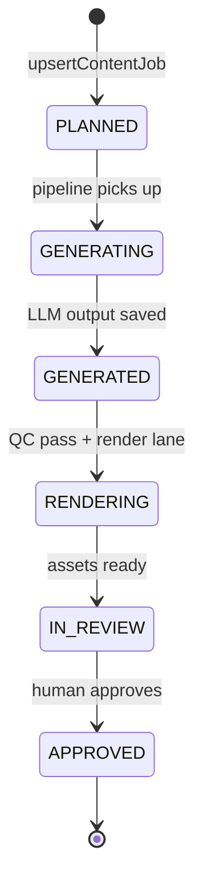
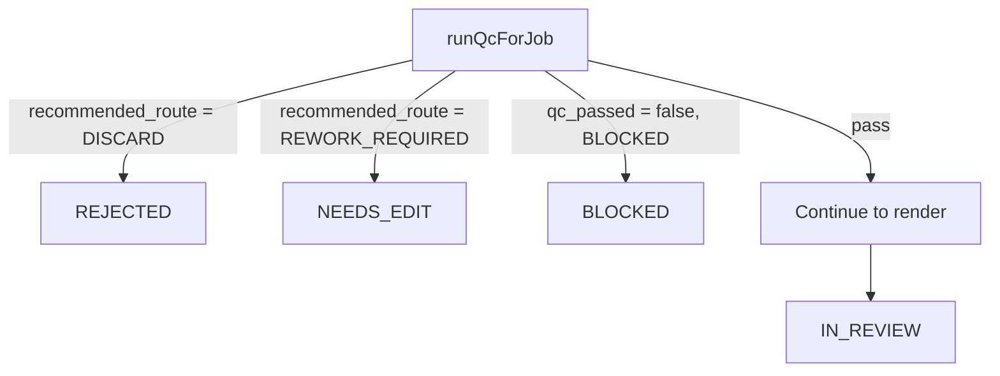
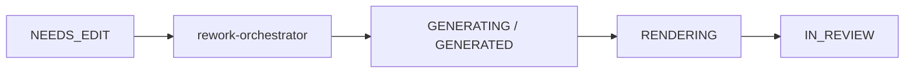

# CAF — Content job lifecycle

**Purpose:** Complete guide to how a **content job** moves from planning through generation, QC, rendering, human review, rework, and publishing. For run-level lifecycle, see **[LIFECYCLE.md](./LIFECYCLE.md)**.

**Key entity:** `caf_core.content_jobs` — unique on **`(project_id, task_id)`**.  
**Source of truth for job JSON:** **`generation_payload`** (+ columns `status`, `qc_status`, `render_state`).

---

## Table of contents

1. [Where a job comes from](#1-where-a-job-comes-from)
2. [The happy path (overview)](#2-the-happy-path-overview)
3. [Status reference](#3-status-reference)
4. [Stage-by-stage detail](#4-stage-by-stage-detail)
5. [QC routing branches](#5-qc-routing-branches)
6. [Rendering paths](#6-rendering-paths)
7. [Human review](#7-human-review)
8. [Rework loop](#8-rework-loop)
9. [After approval: publish](#9-after-approval-publish)
10. [Failure & retry semantics](#10-failure--retry-semantics)
11. [Audit trail](#11-audit-trail)
12. [APIs & operators by stage](#12-apis--operators-by-stage)
13. [Related docs](#13-related-docs)

---

## 1. Where a job comes from

A **content job** is created when a **run** is started and the decision engine selects a planned row.

```text
Signal pack  →  Materialize planned rows on run  →  startRun  →  decideGenerationPlan  →  upsertContentJob
```

| Step | What happens |
|------|----------------|
| Signal pack | Research bundle with ideas (`jobs_json` / legacy formats) |
| Materialize | `POST /v1/runs/:project_slug/:run_id/jobs` writes `runs.planned_jobs_json` |
| Start run | `POST .../start` scores candidates, applies caps, creates jobs |
| Job row | Inserted with `status = PLANNED`, `task_id` assigned, `generation_payload` seeded |

**`task_id` pattern:** `{run_id}__{platform}__{flow_type}__row{NNNN}__{variation}`  
Example: `SNS_2026W09__Instagram__FLOW_CAROUSEL__row0002__v1`

Each job is **one idea × one flow type × one variation**.

---

## 2. The happy path (overview)



**Split-process mode** (common in production):

1. **`POST .../process`** — LLM + QC + diagnostics → job stops at **`GENERATED`** (“package ready”).
2. **`POST .../render`** — render lane → **`IN_REVIEW`**.

This separates expensive generation from expensive rendering.

---

## 3. Status reference

### Primary job statuses

| Status | Meaning |
|--------|---------|
| **`PLANNED`** | Job exists; waiting for pipeline |
| **`GENERATING`** | LLM generation in progress |
| **`GENERATED`** | Draft package ready (`generated_output` in payload); may await render |
| **`RENDERING`** | Media production in progress (carousel, video, mimic) |
| **`IN_REVIEW`** | Waiting for human editorial decision |
| **`APPROVED`** | Human approved — eligible for publish |
| **`REJECTED`** | Human or QC discarded the job |
| **`NEEDS_EDIT`** | Human or QC requested rework |
| **`BLOCKED`** | QC blocked (risk / checklist failure) |
| **`QC_FAILED`** | QC failed without a softer route |
| **`FAILED`** | Pipeline error (generation, render, timeout) |

> **`APPROVED`** is set only via **human review** — QC does not auto-approve by default (`CAF_REQUIRE_HUMAN_REVIEW_AFTER_QC`).

### Editorial decisions (separate table)

Stored on **`caf_core.editorial_reviews.decision`:**

| Decision | Sets job status |
|----------|-----------------|
| `APPROVED` | `APPROVED` |
| `REJECTED` | `REJECTED` |
| `NEEDS_EDIT` | `NEEDS_EDIT` |

---

## 4. Stage-by-stage detail

### 4.1 PLANNED → GENERATING

**Module:** `src/services/job-pipeline.ts` → `advanceToGenerating`

- Pipeline picks up jobs in `PLANNED` (or retries `GENERATING`).
- Offline flow types exit early (`offline-flow-types.ts`).
- Transition logged to **`job_state_transitions`**.

### 4.2 GENERATING → GENERATED

**Module:** `src/services/llm-generator.ts` → `generateForJob`

| Action | Detail |
|--------|--------|
| Prompt resolution | Flow engine templates per `flow_type` + project |
| Creation pack | Signal context, brand, strategy; mimic filters to single idea |
| Learning injection | `getLearningContextForGeneration` appends guidance |
| LLM call | OpenAI (or placeholder mode) |
| Schema validation | `CAF_OUTPUT_SCHEMA_VALIDATION_MODE` |
| Persist | `job_drafts` row + merge `generated_output` into `generation_payload` |
| Status | **`GENERATED`** |

**Mimic prep** (when enabled): reference resolution may run during GENERATING before copy (`mimic-draft-prep.ts`).

### 4.3 GENERATED → QC

**Module:** `src/services/qc-runtime.ts` → `runQcForJob`

| Input | Output |
|-------|--------|
| `generation_payload.generated_output` | `qc_result` slice (via **`mergeGenerationPayloadQc`**) |
| Flow checklist + risk policies + brand bans | `qc_status`, `recommended_route` on job row |

See **[QUALITY_CHECKS.md](./QUALITY_CHECKS.md)**.

### 4.4 Post-QC diagnostic

**Module:** diagnostic audit (machine evaluation snapshot on job).

Runs after QC on the standard path before render.

### 4.5 GENERATED → RENDERING → IN_REVIEW

**Module:** `job-pipeline.ts` render branches

| Flow family | Render path |
|-------------|-------------|
| Carousel | HTTP → `RENDERER_BASE_URL` → PNG slides → `assets` |
| HeyGen video | Submit + poll → MP4 asset |
| Scene assembly | Sora clips + video-assembly stitch/mux |
| Mimic image/carousel | Image provider + HBS/DocAI overlays |

On success: **`finalJobStatusAfterRender`** → **`IN_REVIEW`** (always human gate).

Publish URL helpers may merge into `generation_payload` (`publish_media_urls_json`, `publish_video_url`).

### 4.6 IN_REVIEW → terminal editorial status

**Module:** `src/routes/v1.ts` + Review app

Human decides → `editorial_reviews` row + `content_jobs.status` update.

---

## 5. QC routing branches

After `runQcForJob`, **`routeJobAfterQc`** (`validation-router.ts`) may short-circuit:



| `recommended_route` | Typical next status | Render? |
|---------------------|---------------------|---------|
| `DISCARD` | `REJECTED` | No |
| `REWORK_REQUIRED` | `NEEDS_EDIT` | No |
| `BLOCKED` | `BLOCKED` | No |
| `HUMAN_REVIEW` | Continue → render → `IN_REVIEW` | Yes (if QC passed) |
| `AUTO_PUBLISH` | Still → `IN_REVIEW` when human gate on | Yes |

---

## 6. Rendering paths

### Carousel (`FLOW_CAROUSEL`)

1. Build render pack from `generated_output` + templates.
2. POST slides to carousel renderer.
3. Upload PNGs to Supabase → `assets` rows.
4. Job → **`IN_REVIEW`**.

### Video (HeyGen / scene)

1. Submit render job to provider.
2. Job may stay **`RENDERING`** during long polls.
3. **`hasActiveProviderSession`** prevents double-submit on retry.
4. **`RenderNotReadyError`** → stay `RENDERING`, safe to retry later.
5. On completion → asset + **`IN_REVIEW`**.

### Mimic (`FLOW_TOP_PERFORMER_MIMIC_*`)

Same status enum. Extra prep on `generation_payload.mimic_v1` before/after copy. Render produces `MIMIC_BACKGROUND`, `MIMIC_VISUAL_PLATE`, or carousel slide assets.

Detail: **[MIMIC_FLOWS_COMPLETE_GUIDE.md](./MIMIC_FLOWS_COMPLETE_GUIDE.md)**.

---

## 7. Human review

**Surfaces:** Review app (`apps/review`) or `/v1` review APIs.

| Capability | Description |
|------------|-------------|
| Queue | List jobs in `IN_REVIEW` (per project or all projects) |
| Detail | Full `generation_payload`, assets, QC snapshot |
| Decision | Approve / reject / needs edit |
| Overrides | Script, slides, HeyGen ids, skip regen flags, mimic layer positions |

**Post-approval (optional):** LLM approval review → scores + `upstream_recommendations` → learning observations.

---

## 8. Rework loop

When status is **`NEEDS_EDIT`**:



**Module:** `src/services/rework-orchestrator.ts` → `executeRework`

| Rework type | What re-runs |
|-------------|--------------|
| Copy rewrite | LLM generation |
| Slide edits | Partial carousel re-render |
| Video script | HeyGen re-submit (respects `skip_video_regeneration`) |
| Mimic text overlay | Text reprint path (may stay `IN_REVIEW` during reprint) |

Reviewer notes and `editorial_overrides_json` feed back into the user prompt on rework.

---

## 9. After approval: publish

**Job status:** `APPROVED`

**Publishing** is a separate lifecycle on **`publication_placements`**:

`draft` → `scheduled` → `publishing` → `published` | `failed` | `cancelled`

Linked by **`(project_id, task_id)`** — not a FK.

Executor modes: `none` (external worker), `dry_run`, `meta` (in-Core Graph API).

Detail: **[layers/publishing.md](./layers/publishing.md)**.

---

## 10. Failure & retry semantics

| Situation | Behavior |
|-----------|----------|
| LLM / render exception | `FAILED` + `job_state_transitions` |
| HeyGen still polling | Stay `RENDERING`; use `hasActiveProviderSession` before re-submit |
| Run process retry | `GENERATED` jobs picked up for render; safe `RENDERING` retries per flow rules |
| QC block | `BLOCKED` — manual intervention |
| Mimic text reprint stuck | May mark `FAILED` explicitly vs silent `RENDERING` |

**Run-level processing** scans jobs in `PLANNED`, `GENERATING`, `GENERATED`, `RENDERING` and advances what is eligible.

---

## 11. Audit trail

| Store | Contents |
|-------|----------|
| **`job_state_transitions`** | Every status change (`from_state` → `to_state`) |
| **`job_drafts`** | Each LLM attempt (`attempt_no`, `revision_round`) |
| **`editorial_reviews`** | Human decisions + overrides |
| **`diagnostic_audits`** | Machine quality snapshots |
| **`assets`** | Render outputs with versions |
| **`api_call_audit`** | External API calls (optional cost) |

**Correlation:** trace by `task_id` + `project_id` across all tables.

---

## 12. APIs & operators by stage

| Stage | API / surface |
|-------|----------------|
| Create jobs | `POST /v1/runs/:project_slug/:run_id/start` |
| Process (generate+QC) | `POST /v1/runs/.../process`, `POST /v1/pipeline/...`, `npm run process-run` |
| Render | `POST /v1/runs/.../render` |
| Single job | `POST /v1/jobs/:project_slug/:task_id/process` |
| Review queue | `/v1/review-queue...`, Review app workbench |
| Editorial decision | `POST /v1/reviews` (see `v1.ts`) |
| Rework | Pipeline rework routes → `rework-orchestrator` |
| Publish | `/v1/publications/:project_slug/...` |

---

## 13. Related docs

| Doc | Topic |
|-----|-------|
| [LIFECYCLE.md](./LIFECYCLE.md) | Run lifecycle + publication + learning rule states |
| [layers/job-pipeline.md](./layers/job-pipeline.md) | Execution layer modules |
| [layers/review-rework.md](./layers/review-rework.md) | Review API + rework |
| [DOMAIN_MODEL.md](./DOMAIN_MODEL.md) | IDs and entity relationships |
| [QUALITY_CHECKS.md](./QUALITY_CHECKS.md) | QC runtime detail |
| [MIMIC_FLOWS_COMPLETE_GUIDE.md](./MIMIC_FLOWS_COMPLETE_GUIDE.md) | Mimic job path |

---

*Job lifecycle — from `PLANNED` to `APPROVED`, with QC gates, human review, and rework loops at every step.*
