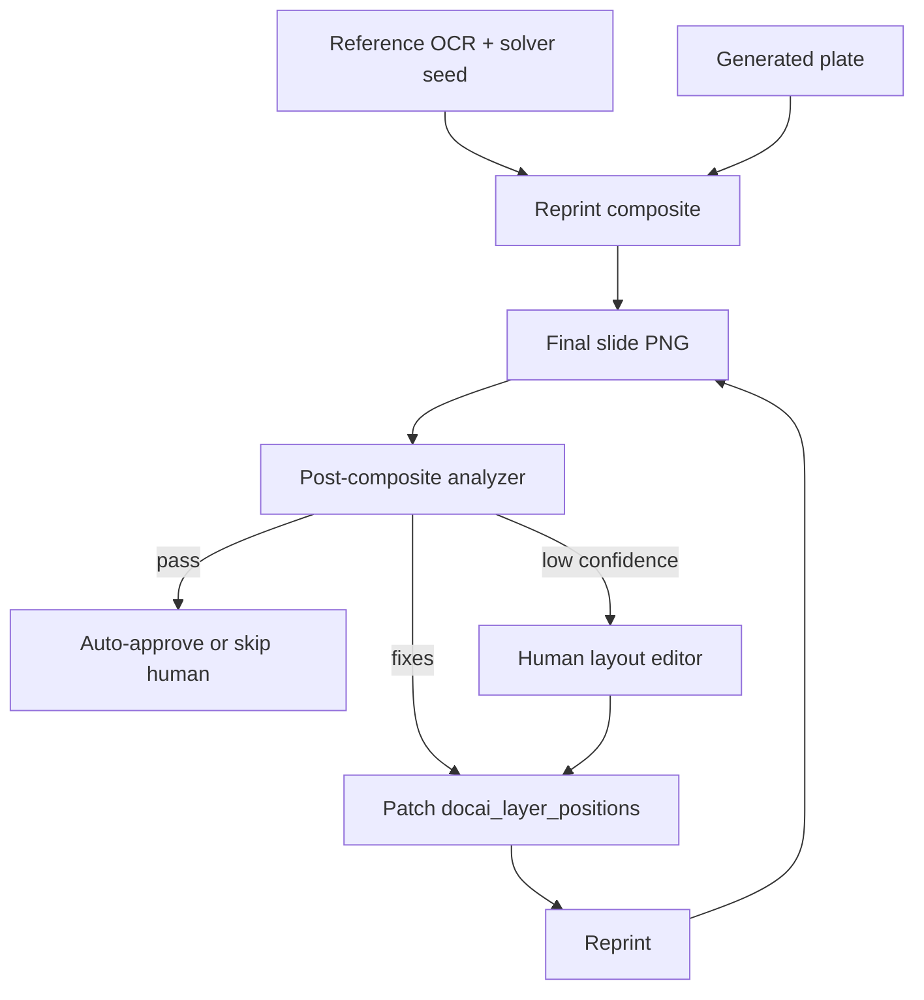

# Mimic Text Placement — Automation Path (Design)

> **Status: Phase A implemented (2026-06).** Post-composite analyzer, auto-reprint loop (cap N),
> Review gate (`BLOCKED` when layout fails), regen state on `render_state.carousel_regenerate`,
> per-slide badges in Review. Vision QA and human suggestion pre-load remain future work.
>
> **For AI assistants:** Cursor rule [`.cursor/rules/mimic-text-placement-automation.mdc`](../.cursor/rules/mimic-text-placement-automation.mdc) — read when the user asks to automate mimic text placement.

## The real problem (not “learn placement once”)

Mimic carousel text placement has **two different inputs** that must not be conflated:

| Input | Stable? | What it tells you |
|-------|---------|-------------------|
| **Reference top-performer slide** (OCR) | Yes, per mimic job | Where text *was* on the *original* — roles, rough geometry, copy structure |
| **Generated art plate** (Flux/Qwen) | **No** — changes every regen | Where faces, products, logos, and busy texture land *on this slide* |

Reference OCR → initial boxes is only a **seed**. It cannot be trusted as final placement
because the model may put the subject exactly where the seed box sits. That is why a human
opens the layout editor today: **on this specific rendered slide**, text is covering something
important or sitting on illegible background.

**Automation cannot primarily mean “learn from past human moves.”** Past jobs had different
plates; a delta from slide A does not predict slide B. Automation must mean:

```text
seed boxes (reference OCR) → HTML reprint → final composite PNG
    → analyze THIS composite
    → “box X is bad here; move to Y”
    → reprint (cheap) → re-analyze or route to human
```

The human editor remains the **exception handler** when the post-render loop cannot reach
confidence. It is not a training-data farm for a static placer.

## What exists today (and what it is *not*)

**Seed path (before human):**

1. Document AI OCR on the **reference** slide.
2. [`src/services/mimic-docai-overlay-layout.ts`](../src/services/mimic-docai-overlay-layout.ts)
   maps copy → `docai_text_layers` (roles, single vs multi-line).
3. [`services/renderer/mimic-docai-fit.js`](../services/renderer/mimic-docai-fit.js) fits
   font size and resolves **box–box** collisions at render time.
4. [`services/renderer/mimic-docai-contrast.js`](../services/renderer/mimic-docai-contrast.js)
   samples the **background plate** (not the composite) for text color/contrast.

**Human path:**

- [`MimicDocAiLayerPositionEditor.tsx`](../apps/review/src/components/MimicDocAiLayerPositionEditor.tsx)
  writes corrections to `docai_layer_positions`.

**Cheap iteration:**

- **Reprint** recomposites HTML on stored plates (no Flux). This is the loop motor for any
  automated fixer.

**Gap:** Nothing today re-examines the **printed slide** (image + overlay together) and asks
“did we ruin this slide?” Pre-render `mimic_avoid_center_subject` uses heuristics on the
plate only — it cannot see that headline landed on a face after this particular generation.

## The automation spine: post-composite placement QA

This is the step automation must solve. Everything else is supporting.



### What the analyzer looks at

Re-running “OCR” on a slide that already contains your text is noisy (it reads overlay +
background). The useful signal is **placement QA on the composite**, not re-extracting copy:

| Check | Question | Typical failure |
|-------|----------|-----------------|
| **Saliency / subject overlap** | Do text boxes intersect faces, products, logos, or high-detail regions? | Headline on a face |
| **Legibility** | Is contrast sufficient in the box region (extend existing contrast pass to composite)? | Light text on light sky |
| **Box collision** | Do boxes overlap each other after fit? | Already partly in `mimic-docai-fit.js` |
| **Margin / safe zone** | Are boxes clipped or hugging edges? | CTA cut off |
| **Copy completeness** | Is all intended copy visible (not hidden/off-canvas)? | Solver dropped a line |

Outputs are still **`docai_layer_positions` patches** — same schema as the human editor:

```jsonc
{
  "layer_key": "headline@0",
  "x_px": 96, "y_px": 280, "w_px": 888, "h_px": 200,
  "source": "post_render_qa",   // ocr | post_render_qa | human | vision
  "fix_reason": "subject_overlap" // optional: why this move was proposed
}
```

Provenance values:

- `ocr` — seed from reference layout solver (default, pre-QA).
- `post_render_qa` — moved by the composite analyzer (automation).
- `human` — reviewer edit in the drag editor.
- `vision` — optional vision-LLM suggestion before first print (see below).

### Analyzer implementation options (ranked)

**1. Deterministic composite QA (build first)**  
Render once, run vision/heuristics on the PNG:

- Subject/saliency map on the **composite** (or plate + known box mask).
- Penalize boxes whose area overlaps salient pixels above a threshold.
- Search nearby positions (grid or slide “quiet zones”) that preserve copy and clear overlap.
- Reuse contrast sampling from `mimic-docai-contrast.js` against the region under each box.

No training data required; works per slide, per generation.

**2. Vision-model QA (suggestion / hard cases)**  
Send the **composite PNG** + box list + target copy to a vision model: “which boxes should
move and where?” Return the same JSON schema with `source: "post_render_qa"`. Use when
deterministic QA is uncertain.

**3. Vision-model pre-placement (optional, not sufficient alone)**  
Propose initial boxes from **generated plate + copy** before first print (`source: "vision"`).
Still must pass through step 1 after print — unpredictable generation means pre-placement
alone is never enough.

**4. Stronger reference seed (supporting only)**  
Improve `mimic-docai-overlay-layout.ts` (copy anchoring, roles, center-avoid). Reduces how
often QA must move boxes; does **not** replace post-composite QA.

**5. Learning from human corrections (deprioritized)**  
Storing OCR seed vs human final across jobs is optional telemetry for improving heuristics or
few-shot prompts. It is **not** the primary automation path because plates differ every time.

## Confidence gate (when to skip the human)

After each reprint, compute a **placement score** from composite QA:

- overlap with salient regions (weight high),
- contrast legibility,
- inter-box collision,
- margin violations.

| Score | Action |
|-------|--------|
| High | Auto-approve slide for review queue (or auto-publish path later) |
| Medium | Apply QA patches, reprint once more, re-score |
| Low | Open human layout editor with QA suggestions pre-loaded |

**Implemented policy (2026-06):** auto-reprint runs on soft findings (collision, margin, subject zone). All jobs reach **`IN_REVIEW`**; `layout_qc.review_attention` + thumb badges flag slides that need layout editor polish before publish. Layout QA does **not** `BLOCK` jobs by default (`MIMIC_LAYOUT_QA_BLOCK_*` both default off).

This turns the editor from “default for every slide” into “only when this generation fought us.”

## Design principle: one schema, two phases

Keep a single box schema for seed, QA fixes, and human edits so the pipeline stays one path:

| Phase | Who writes boxes | When |
|-------|------------------|------|
| Seed | Reference OCR + solver | After plate exists, before or after first print |
| **QA fix** | **Post-composite analyzer** | **After each print — the automation step** |
| Human override | Reviewer | When QA confidence is low or brand judgment needed |

The editor overhaul already emits this shape; `source` (and optional `fix_reason`) records
which phase last moved a box. Persisting `source` through Core is small future plumbing.

## How current product pieces support this

| Piece | Role in post-render loop |
|-------|--------------------------|
| HTML overlay + reprint | Cheap iterate: QA → patch → reprint without Flux |
| `docai_layer_positions` | QA and human write the same patch format |
| Brand palette swatches (editor 1.5) | QA can auto-pick legible `color_hex` from palette |
| Regenerate route (similarity / reference) | Only when the **plate** is wrong, not placement |
| `mimic-docai-contrast.js` | Extend to sample **composite** under each box |
| Human layout editor | Exception UI; show QA moves as suggestions to accept/nudge |

## Suggested build order

1. **Composite overlap detector** — given PNG + box list, flag boxes intersecting salient/busy
   regions (deterministic or light vision model).
2. **Box nudge solver** — search local positions that clear flags; emit `post_render_qa` patches.
3. **Reprint loop in pipeline** — after mimic render, run QA → patch → reprint (cap N iterations).
4. **Confidence gate** — score → auto-pass vs human queue; surface QA suggestions in editor.
5. *(Optional)* Vision QA for hard slides; *(optional)* telemetry from human finals.

## Not in scope yet

- Vision-model QA for hard slides (deterministic analyzer is live).
- Auto reprint loop without human-in-the-loop approval on low-confidence slides (auto-reprint runs in pipeline; human editor still exception path).
- Training / finetuning on historical correction pairs.
